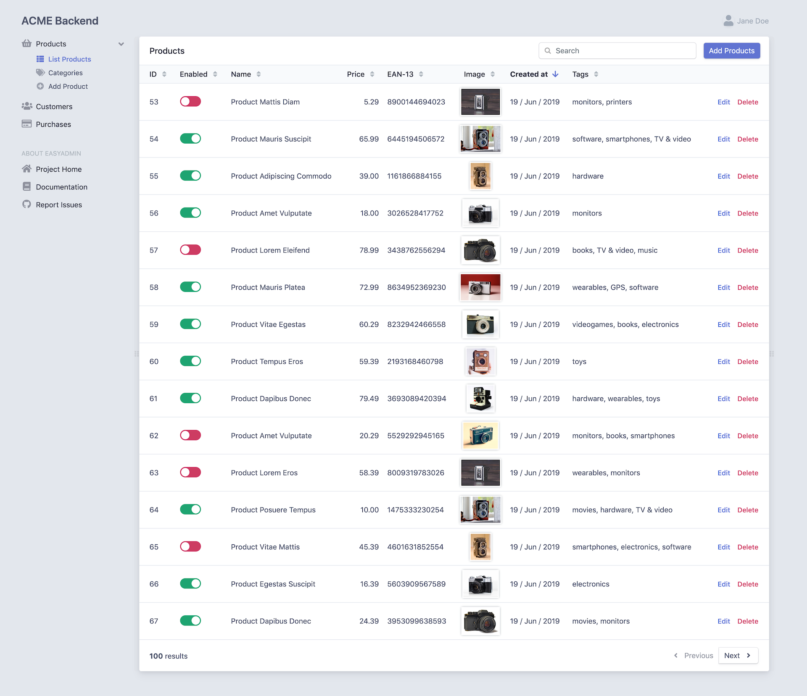

EasyAdmin Demo
==============

A demo application to showcase the main features of [EasyAdmin][1], the new and
simple admin generator for [Symfony][2] applications.

Requirements
------------

  * PHP 7.1.3 or higher;
  * PDO-SQLite PHP extension enabled;
  * and the [usual Symfony application requirements][3].

How to install this project
---------------------------

  1. `git clone https://github.com/javiereguiluz/easy-admin-demo`
  1. `cd easy-admin-demo/`
  1. `composer install`
  1. `php bin/console server:run`
  1. Browse `http://127.0.0.1:8000/admin/`

The project comes with an SQLite sample database, but you can also create your
own database and load the fixtures data:

  1. Edit the `DATABASE_URL` env var in the `.env` file to use your database credentials.
  1. `php bin/console doctrine:database:create`
  1. `php bin/console doctrine:schema:create`
  1. `php bin/console doctrine:fixtures:load --append`

Tests
-----

Execute this command to run tests:

```bash
$ easy-admin-demo/
$ ./vendor/bin/simple-phpunit
```

Screenshot
----------



[1]: https://github.com/EasyCorp/EasyAdminBundle
[2]: https://symfony.com
[3]: https://symfony.com/doc/current/reference/requirements.html
